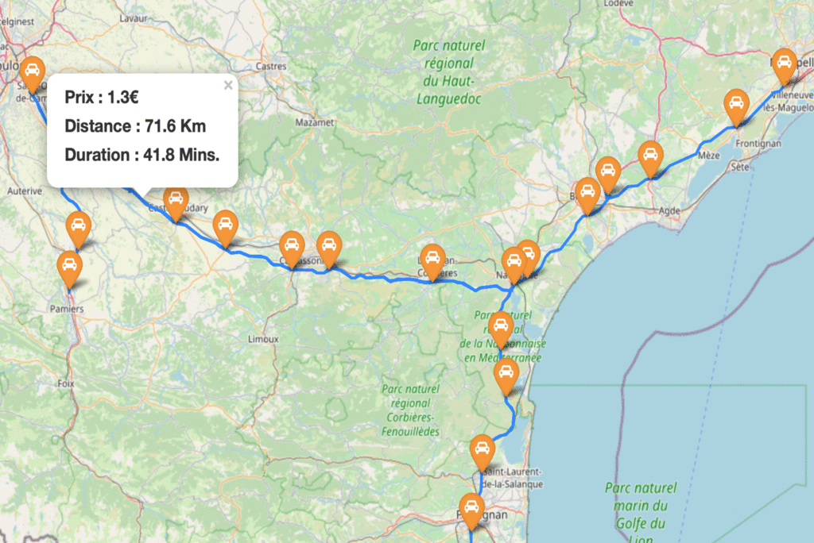
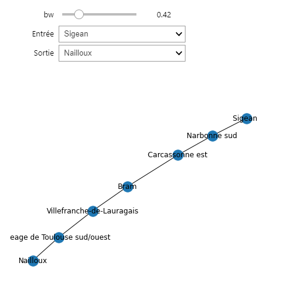
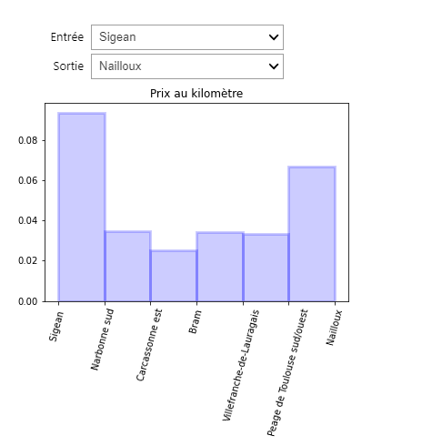
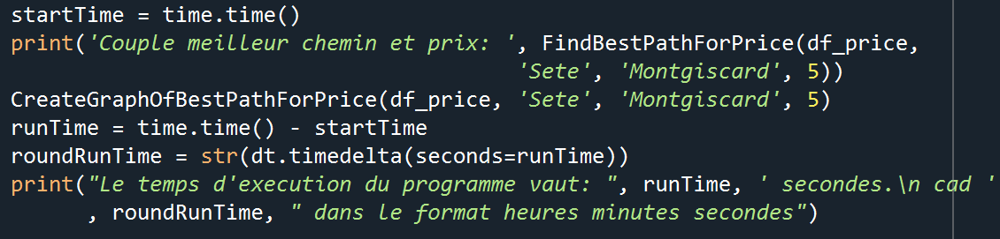
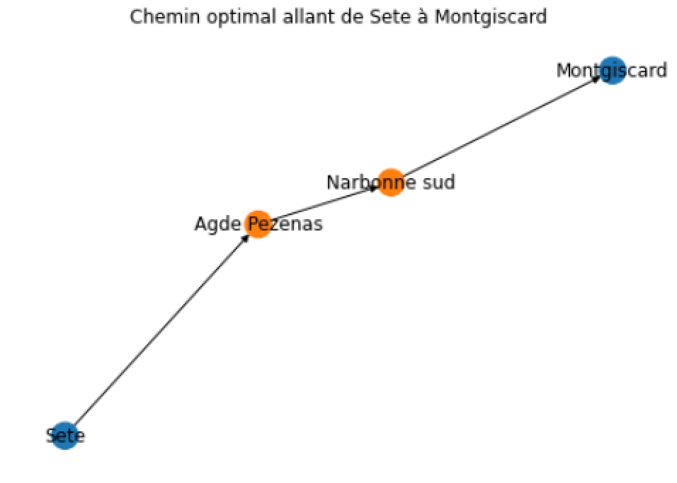
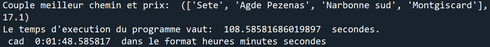
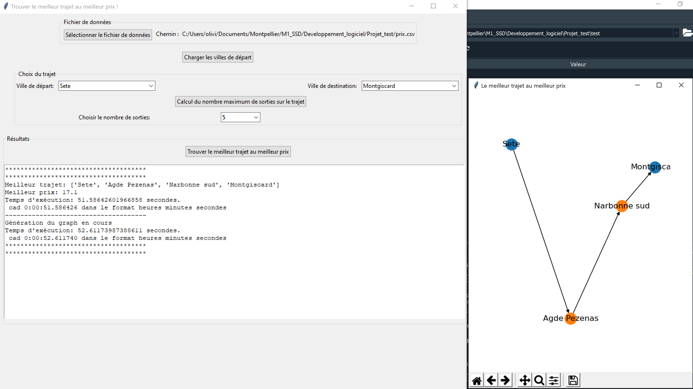

Documentation
=============
Vous trouverez ici toute la documentation concernant le package ``Coberny``. Tous les modules sont décrits et documenter pour permettre aux utilisateurs de mieux manier le package. Bonne lecture ! \

Voici un petit aperçu du rendu d'une des fonctions!!

\ 

Carte
-----
Le module Carte permet de créer une carte enregistrée automatiquement sous format html, sur laquelle nous pouvons afficher les différentes gares de péage présentes dans le jeu de données. Il est possible de clique sur les gares pour voir les noms s'afficher et nous pouvons cliquer entre deux portions d'autoroute pour voir des données sur ce trajet. 

.. automodule:: Coberny.map.Carte
   :members:
 

\   

Distribution
------------
Le module Distribution nous permet créer un Kernel Density Estimation (KDE)  qui est une méthode non-paramétrique d’estimation de la densité de probabilité d’une variable aléatoire. Ici, nous allons utiliser le prix au kilomètre comme variable aléatoire. Le KDE va être celui de l'estimation de la densité de la variable Prix/Kilomètre. De plus, ce module nous permet de visualiser les prix au kilomètre sur chaque section de la portion d'autoroute souhaitée.

.. automodule:: Coberny.distribution_of_price.distribution
   :members: 
   
Si nous exécutons ce code, nous obtenons :

\

Graph et minimisation du coût
-----------------------------
Le module Graph et minimisation permet de déterminer et de visualiser le trajet revenant le moins cher si l'on souhaite se déplacer d'une ville A de départ à une ville B d'arrivée.

.. automodule:: Coberny.graph_min_cost.best_price_path
   :members:
   

   
Si nous exécutons ce code nous obtenons :

   

Pour simplifier la prise en main de notre package, nous avons également crée une interface utilisateur.

Comme vous pouvez le voir sur l'image ci-dessus, ce dernier va pouvoir via l'utilisation de boutons et de widgets, charger son fichier de données, charger les villes de départs et en choisir une. Il va pouvoir ensuite choisir la ville d'arrivée tout en renseignant sur la contrainte du nombre de sorties maximales. Enfin, il pourra cliquer sur le bouton qui exécutera l'algorithme déterminant quel est le chemin optimal pour son trajet.

\
