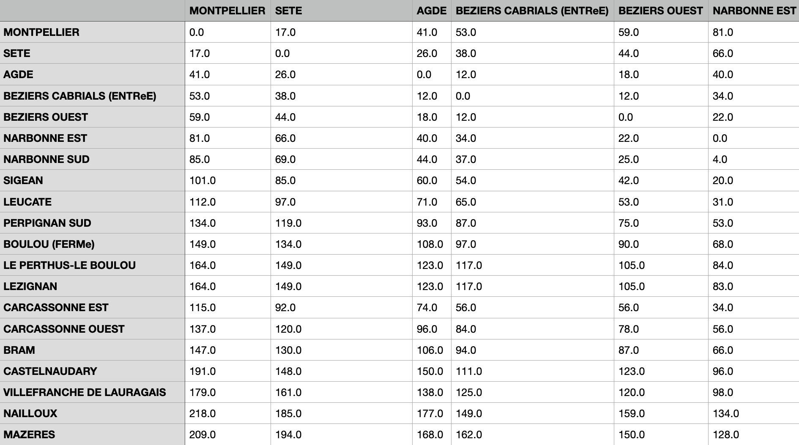
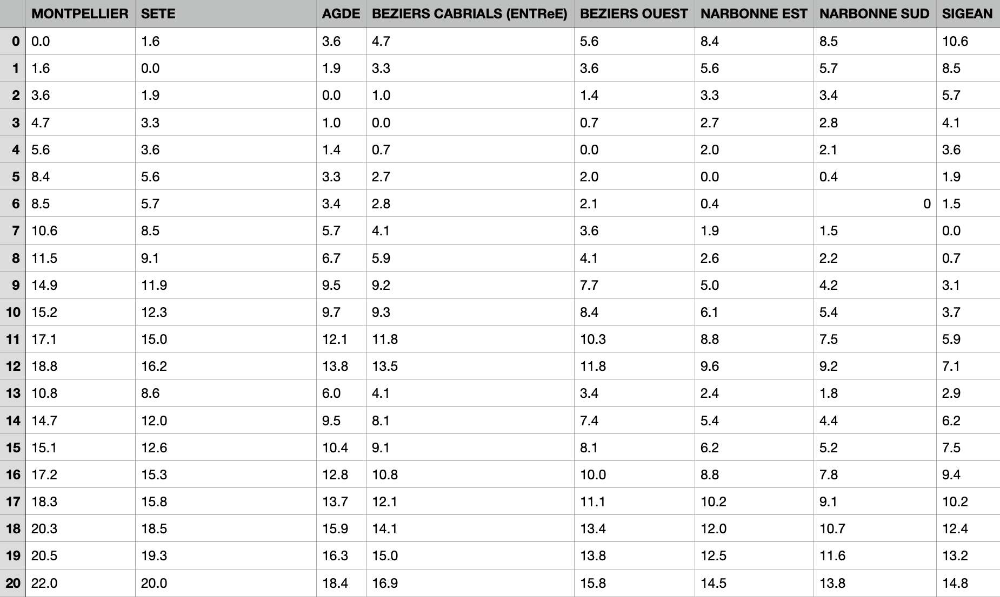
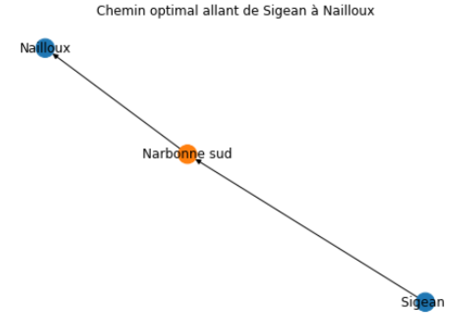

Données à titre d'exemple
=========================

Voici un extrait des données que nous avons utilisé pour illustrer les fonctions du package. Vous pouvez les retrouver également sur le lien suivant : https://github.com/ABernard27/PROJET-groupe-3.git

Un extrait du tableau des distances
--------------------------------------

Un extrait du tableau des prix
-------------------------------

Un extrait du graph représentant le chemin optimal (celui revenant le moins cher) entre Sigean (ville de départ) et Nailloux (ville d'arrivée).
------------------------------------------------------------------------------------------------------------------------------------------------

